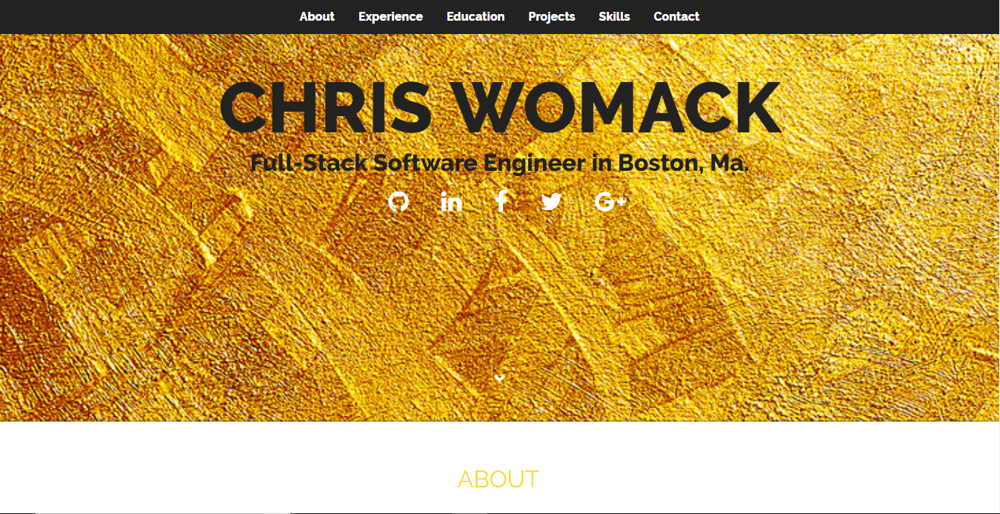

# My Awesome Level Ground
My portfolio has been created, fully responsive using HTML and CSS.

## How It's Made:

**Tech used:** HTML, CSS

In this project I used HTML and CSS to construct a professional portfolio for employers to evaluate my candidacy for jobs.

## Lessons Learned:

During the construction of this portfolio I learned how to customize my first template as well as make important content decisions about what information is most important to include about myself when employers or clients are reading about me.
